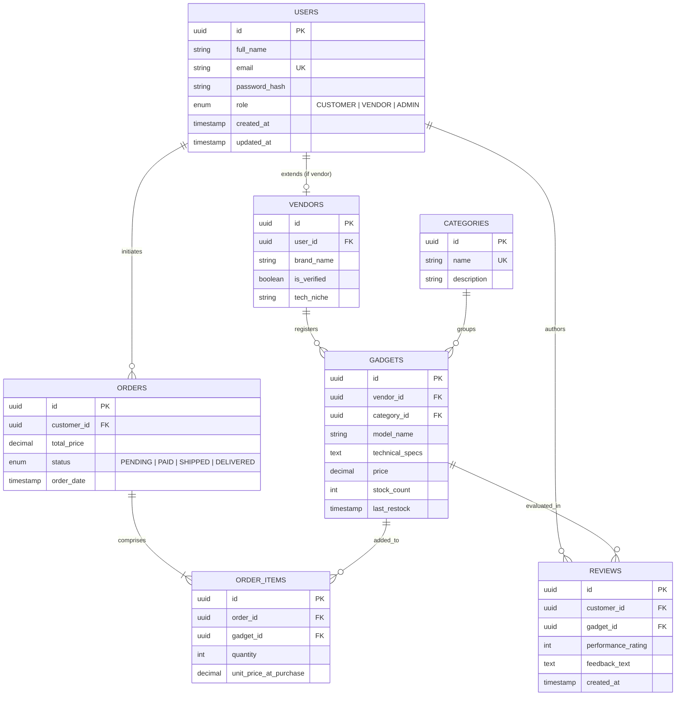

# ER Diagram — TechSpark
## Overview
The TechSpark database schema is designed for consistency, integrity, and scalability, featuring normalized tables for users, tech inventory, and order processing.

---

## Schema Highlights
- **Role Separation**: Vendors have their own specialized table linked to the User record.
- **Data Integrity**: Enums for roles and statuses prevent invalid state transitions.
- **Audit Ready**: `created_at` and `updated_at` fields in core tables for tracking changes.
- **Niche Focus**: `technical_specs` stored as structured text/JSON to hold varied gadget data.
