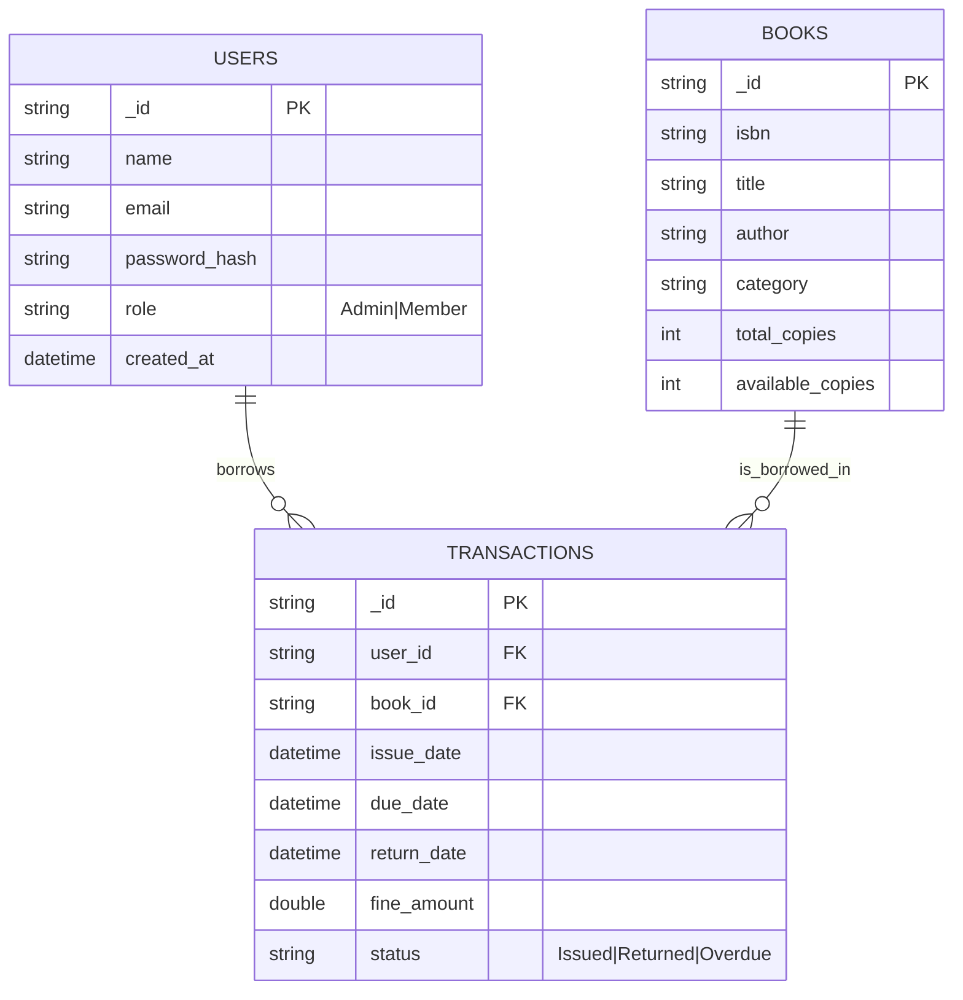

# ER Diagram

```mermaid
erDiagram
    USERS {
        string _id PK
        string name
        string email
        string password_hash
        string role "Admin|Member"
        datetime created_at
    }

    BOOKS {
        string _id PK
        string isbn
        string title
        string author
        string category
        int total_copies
        int available_copies
    }

    TRANSACTIONS {
        string _id PK
        string user_id FK
        string book_id FK
        datetime issue_date
        datetime due_date
        datetime return_date
        double fine_amount
        string status "Issued|Returned|Overdue"
    }

    USERS ||--o{ TRANSACTIONS : "borrows"
    BOOKS ||--o{ TRANSACTIONS : "is_borrowed_in"
```
