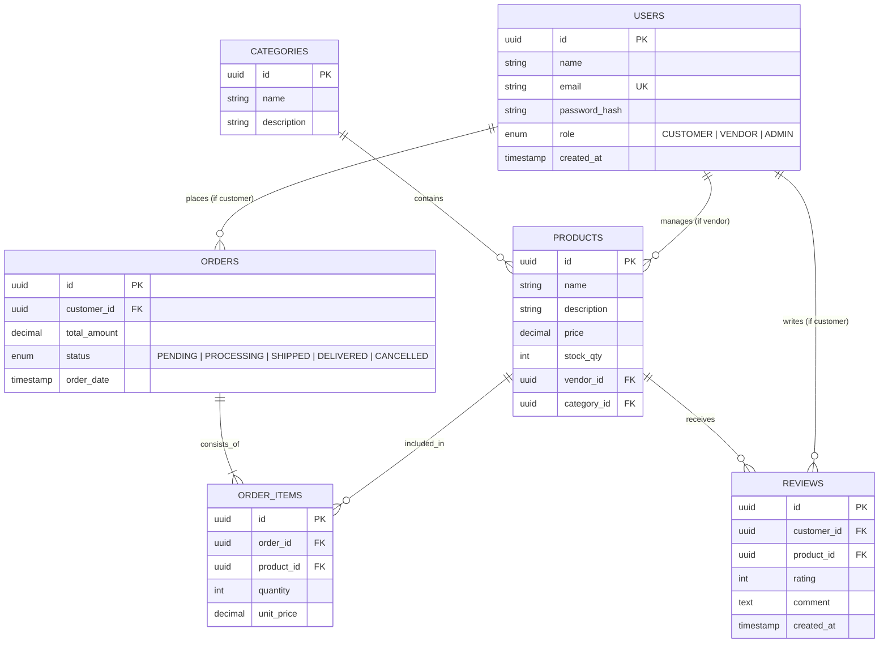

# ER Diagram — NexaRetail

## Overview
This Entity-Relationship diagram defines the database schema for the NexaRetail E-commerce platform, including tables for users, products, orders, and their relationships.

---

