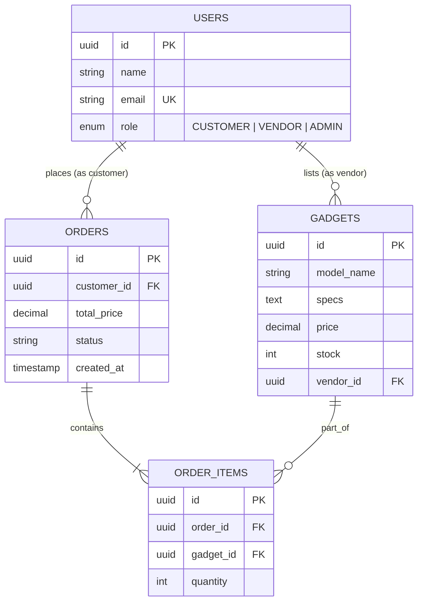

# ER Diagram — TechSpark

## Overview
Database schema for the TechSpark exclusive gadget marketplace.

---

```mermaid
erDiagram
    USERS {
        uuid id PK
        string name
        string email UK
        enum role "CUSTOMER | VENDOR | ADMIN"
    }

    GADGETS {
        uuid id PK
        string model_name
        text specs
        decimal price
        int stock
        uuid vendor_id FK
    }

    ORDERS {
        uuid id PK
        uuid customer_id FK
        decimal total_price
        string status
        timestamp created_at
    }

    ORDER_ITEMS {
        uuid id PK
        uuid order_id FK
        uuid gadget_id FK
        int quantity
    }

    USERS ||--o{ GADGETS : "lists (as vendor)"
    USERS ||--o{ ORDERS : "places (as customer)"
    ORDERS ||--|{ ORDER_ITEMS : "contains"
    GADGETS ||--o{ ORDER_ITEMS : "part_of"
```
