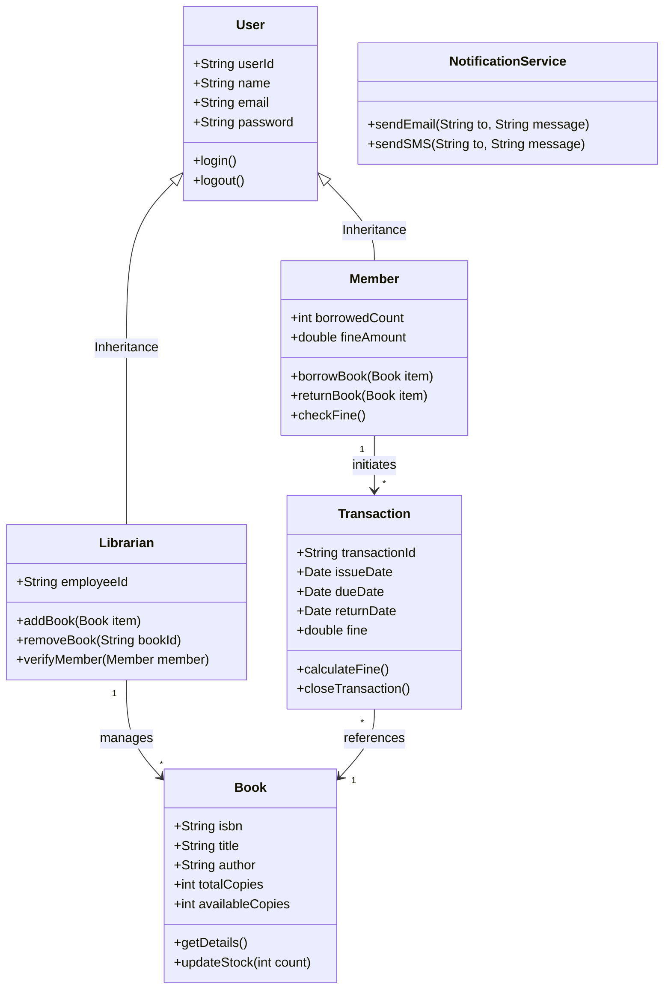

# Class Diagram

```mermaid
classDiagram
    class User {
        +String userId
        +String name
        +String email
        +String password
        +login()
        +logout()
    }

    class Member {
        +int borrowedCount
        +double fineAmount
        +borrowBook(Book item)
        +returnBook(Book item)
        +checkFine()
    }

    class Librarian {
        +String employeeId
        +addBook(Book item)
        +removeBook(String bookId)
        +verifyMember(Member member)
    }

    class Book {
        +String isbn
        +String title
        +String author
        +int totalCopies
        +int availableCopies
        +getDetails()
        +updateStock(int count)
    }

    class Transaction {
        +String transactionId
        +Date issueDate
        +Date dueDate
        +Date returnDate
        +double fine
        +calculateFine()
        +closeTransaction()
    }

    class NotificationService {
        +sendEmail(String to, String message)
        +sendSMS(String to, String message)
    }

    User <|-- Member : Inheritance
    User <|-- Librarian : Inheritance
    Member "1" --> "*" Transaction : initiates
    Librarian "1" --> "*" Book : manages
    Transaction "*" --> "1" Book : references
```
