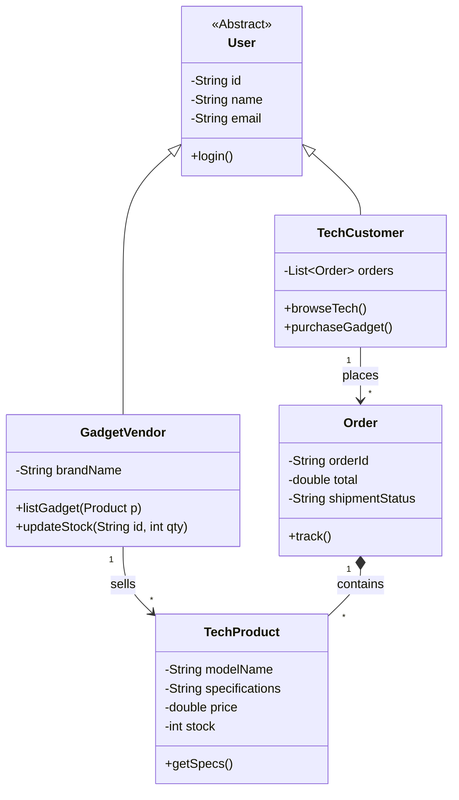

# Class Diagram — TechSpark

## Overview
This class diagram shows the domain actors and core gadget-related classes for the TechSpark platform.

---

```mermaid
classDiagram
    class User {
        <<Abstract>>
        -String id
        -String name
        -String email
        +login()
    }

    class TechCustomer {
        -List~Order~ orders
        +browseTech()
        +purchaseGadget()
    }

    class GadgetVendor {
        -String brandName
        +listGadget(Product p)
        +updateStock(String id, int qty)
    }

    class TechProduct {
        -String modelName
        -String specifications
        -double price
        -int stock
        +getSpecs()
    }

    class Order {
        -String orderId
        -double total
        -String shipmentStatus
        +track()
    }

    User <|-- TechCustomer
    User <|-- GadgetVendor
    GadgetVendor "1" --> "*" TechProduct : sells
    TechCustomer "1" --> "*" Order : places
    Order "1" *-- "*" TechProduct : contains
```
