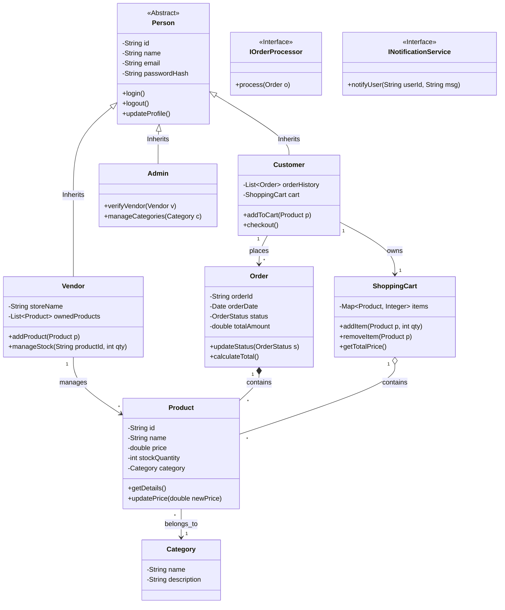

# Class Diagram — NexaRetail

## Overview
This class diagram illustrates the domain models and services for the NexaRetail E-commerce platform, emphasizing OOP principles like inheritance, abstraction, and encapsulation.

---

## OOP Principles Applied
| Principle | Application |
|---|---|
| **Encapsulation** | Private fields with public getters/setters and methods in all domain models. |
| **Inheritance** | `Customer`, `Vendor`, and `Admin` inherit from the abstract `Person` class. |
| **Abstraction** | Interfaces like `IOrderProcessor` and `INotificationService` hide implementation details. |
| **Polymorphism** | Different `Person` types can have specific implementations of shared behaviors. |
