```mermaid
classDiagram
    direction TB

    %% ===== DOMAIN MODELS =====

    class User {
        -id: string
        -email: string
        -passwordHash: string
        -name: string
        -role: UserRole
        -gridZoneId: string
        -isActive: boolean
        -createdAt: Date
        +getProfile(): UserProfile
        +updateProfile(dto: UpdateProfileDto): void
        +deactivate(): void
    }

    class UserRole {
        <<enumeration>>
        PROSUMER
        CONSUMER
        GRID_OPERATOR
        ADMIN
    }

    class Prosumer {
        -energySources: EnergySource[]
        -smartMeters: SmartMeter[]
        -carbonCredits: number
        +addEnergySource(source: EnergySource): void
        +registerMeter(meter: SmartMeter): void
        +getNetEnergy(): number
        +createSellOrder(dto: CreateOrderDto): Order
    }

    class Consumer {
        -monthlyConsumption: number
        +createBuyOrder(dto: CreateOrderDto): Order
        +getConsumptionHistory(): EnergyReading[]
    }

    class EnergySource {
        -id: string
        -type: EnergySourceType
        -capacity: number
        -installedDate: Date
        -prosumerId: string
        +getOutput(weather: WeatherData): number
    }

    class EnergySourceType {
        <<enumeration>>
        SOLAR
        WIND
        BATTERY
        HYDRO
    }

    class SmartMeter {
        -id: string
        -serialNumber: string
        -userId: string
        -gridZoneId: string
        -status: MeterStatus
        +getLatestReading(): EnergyReading
        +getReadings(from: Date, to: Date): EnergyReading[]
    }

    class EnergyReading {
        -id: string
        -meterId: string
        -production: number
        -consumption: number
        -netEnergy: number
        -timestamp: Date
    }

    class Order {
        -id: string
        -userId: string
        -type: OrderType
        -quantity: number
        -pricePerKwh: number
        -status: OrderStatus
        -gridZoneId: string
        -timeWindowStart: Date
        -timeWindowEnd: Date
        -sourceType: EnergySourceType
        -createdAt: Date
        +cancel(): void
        +match(counterOrder: Order): Trade
        +isExpired(): boolean
        +getStateHandler(): OrderStateHandler
    }

    class OrderType {
        <<enumeration>>
        BUY
        SELL
    }

    class OrderStatus {
        <<enumeration>>
        ACTIVE
        MATCHED
        PARTIALLY_FILLED
        CANCELLED
        EXPIRED
    }

    class Trade {
        -id: string
        -buyOrderId: string
        -sellOrderId: string
        -buyerId: string
        -sellerId: string
        -quantity: number
        -pricePerKwh: number
        -totalAmount: number
        -status: TradeStatus
        -gridZoneId: string
        -executedAt: Date
        +confirmDelivery(): void
        +getTotalWithFee(): number
    }

    class TradeStatus {
        <<enumeration>>
        PENDING
        DELIVERED
        SETTLED
        DISPUTED
        CANCELLED
    }

    class Settlement {
        -id: string
        -tradeId: string
        -sellerAmount: number
        -platformFee: number
        -carbonCreditsIssued: number
        -status: SettlementStatus
        -settledAt: Date
        +process(): void
    }

    class Wallet {
        -id: string
        -userId: string
        -balance: number
        -escrowBalance: number
        +credit(amount: number): void
        +debit(amount: number): void
        +holdEscrow(amount: number): void
        +releaseEscrow(amount: number): void
        +getAvailableBalance(): number
    }

    class GridZone {
        -id: string
        -name: string
        -boundary: GeoJSON
        -maxCapacity: number
        -currentLoad: number
        -status: ZoneStatus
        +isOverloaded(): boolean
        +halt(): void
        +resume(): void
    }

    class CommunityGroup {
        -id: string
        -name: string
        -gridZoneId: string
        -memberIds: string[]
        -createdBy: string
        +addMember(userId: string): void
        +removeMember(userId: string): void
        +getGroupStats(): GroupStats
    }

    class CarbonCredit {
        -id: string
        -prosumerId: string
        -tradeId: string
        -kWhGenerated: number
        -certificateHash: string
        -issuedAt: Date
    }

    class Notification {
        -id: string
        -userId: string
        -type: NotificationType
        -title: string
        -message: string
        -isRead: boolean
        -createdAt: Date
        +markAsRead(): void
    }

    class PriceAlert {
        -id: string
        -userId: string
        -gridZoneId: string
        -targetPrice: number
        -direction: AlertDirection
        -isActive: boolean
        +evaluate(currentPrice: number): boolean
    }

    class AuditLog {
        -id: string
        -userId: string
        -action: string
        -entityType: string
        -entityId: string
        -details: JSON
        -timestamp: Date
    }

    %% ===== SERVICE LAYER (Key Services) =====

    class OrderService {
        -orderRepo: IOrderRepository
        -validationChain: OrderValidator
        -matchingEngine: MatchingEngine
        +createOrder(dto: CreateOrderDto): Order
        +cancelOrder(orderId: string): void
        +getOrderBook(zoneId: string): OrderBook
    }

    class MatchingEngine {
        -strategy: IMatchingStrategy
        -orderRepo: IOrderRepository
        +setStrategy(strategy: IMatchingStrategy): void
        +findMatch(order: Order): Order?
        +executeMatch(buyOrder: Order, sellOrder: Order): Trade
    }

    class IMatchingStrategy {
        <<interface>>
        +match(order: Order, candidates: Order[]): Order?
    }

    class PriceTimePriorityStrategy {
        +match(order: Order, candidates: Order[]): Order?
    }

    class ProximityFirstStrategy {
        +match(order: Order, candidates: Order[]): Order?
    }

    class GreenSourceFirstStrategy {
        +match(order: Order, candidates: Order[]): Order?
    }

    class PricingService {
        -strategy: IPricingStrategy
        -cache: RedisCache
        +getCurrentPrice(zoneId: string): number
        +updatePrice(zoneId: string, tradePrice: number): void
        +setStrategy(strategy: IPricingStrategy): void
    }

    class IPricingStrategy {
        <<interface>>
        +calculatePrice(zone: GridZone, supply: number, demand: number): number
    }

    class SupplyDemandPricing {
        +calculatePrice(zone: GridZone, supply: number, demand: number): number
    }

    class TimeOfDayPricing {
        +calculatePrice(zone: GridZone, supply: number, demand: number): number
    }

    class SettlementService {
        -walletService: WalletService
        -carbonCreditRepo: ICarbonCreditRepository
        +processSettlement(trade: Trade): Settlement
        #calculateAmounts(trade: Trade): SettlementAmounts
        #transferFunds(amounts: SettlementAmounts): void
        #issueCarbonCredits(trade: Trade): CarbonCredit
    }

    class NotificationService {
        -observers: INotificationObserver[]
        +subscribe(observer: INotificationObserver): void
        +notify(event: TradeEvent): void
        +sendAlert(userId: string, notification: Notification): void
    }

    class INotificationObserver {
        <<interface>>
        +onEvent(event: TradeEvent): void
    }

    class WalletService {
        -walletRepo: IWalletRepository
        +getBalance(userId: string): number
        +credit(userId: string, amount: number): void
        +debit(userId: string, amount: number): void
        +holdEscrow(userId: string, amount: number): void
        +releaseEscrow(escrowId: string): void
    }

    %% ===== VALIDATION CHAIN =====

    class OrderValidator {
        <<abstract>>
        #next: OrderValidator
        +setNext(validator: OrderValidator): OrderValidator
        +validate(order: Order): ValidationResult
        #doValidate(order: Order): ValidationResult*
    }

    class QuantityValidator {
        #doValidate(order: Order): ValidationResult
    }

    class PriceRangeValidator {
        #doValidate(order: Order): ValidationResult
    }

    class TimeWindowValidator {
        #doValidate(order: Order): ValidationResult
    }

    class ComplianceValidator {
        #doValidate(order: Order): ValidationResult
    }

    %% ===== REPOSITORY INTERFACES =====

    class IOrderRepository {
        <<interface>>
        +findById(id: string): Order
        +findActiveByZone(zoneId: string): Order[]
        +save(order: Order): Order
        +update(order: Order): void
    }

    class IUserRepository {
        <<interface>>
        +findById(id: string): User
        +findByEmail(email: string): User
        +save(user: User): User
    }

    class IWalletRepository {
        <<interface>>
        +findById(userId: string): Wallet
        +save(wallet: Wallet): Wallet
        +update(wallet: Wallet): void
    }

    class ICarbonCreditRepository {
        <<interface>>
        +findByProsumerId(id: string): CarbonCredit[]
        +save(credit: CarbonCredit): CarbonCredit
    }

    %% ===== RELATIONSHIPS =====

    User <|-- Prosumer : extends
    User <|-- Consumer : extends
    User --> UserRole
    User "1" --> "1" Wallet : has
    Prosumer "1" --> "*" EnergySource : owns
    Prosumer "1" --> "*" SmartMeter : registers
    Prosumer "1" --> "*" CarbonCredit : earns
    EnergySource --> EnergySourceType
    SmartMeter "1" --> "*" EnergyReading : produces
    User "1" --> "*" Order : places
    Order --> OrderType
    Order --> OrderStatus
    Order "2" --> "1" Trade : forms
    Trade --> TradeStatus
    Trade "1" --> "1" Settlement : settles
    User "1" --> "*" Notification : receives
    User "1" --> "*" PriceAlert : configures
    GridZone "1" --> "*" Order : contains
    GridZone "1" --> "*" CommunityGroup : hosts
    CommunityGroup "*" --> "*" User : includes

    OrderService --> IOrderRepository
    OrderService --> MatchingEngine
    OrderService --> OrderValidator
    MatchingEngine --> IMatchingStrategy
    IMatchingStrategy <|.. PriceTimePriorityStrategy : implements
    IMatchingStrategy <|.. ProximityFirstStrategy : implements
    IMatchingStrategy <|.. GreenSourceFirstStrategy : implements
    PricingService --> IPricingStrategy
    IPricingStrategy <|.. SupplyDemandPricing : implements
    IPricingStrategy <|.. TimeOfDayPricing : implements
    SettlementService --> WalletService
    SettlementService --> ICarbonCreditRepository
    NotificationService --> INotificationObserver
    WalletService --> IWalletRepository

    OrderValidator <|-- QuantityValidator : extends
    OrderValidator <|-- PriceRangeValidator : extends
    OrderValidator <|-- TimeWindowValidator : extends
    OrderValidator <|-- ComplianceValidator : extends
```

# Class Diagram — GreenGrid

## Overview

This class diagram shows the major classes, their attributes, methods, and relationships across the GreenGrid platform. The design follows **Clean Architecture** (Controller → Service → Repository) with strong **OOP principles** and **design patterns**.

---

---

## Design Patterns in the Class Diagram

| Pattern | Where Applied | Purpose |
|---------|---------------|---------|
| **Strategy** | `IMatchingStrategy`, `IPricingStrategy` | Swap matching/pricing algorithms at runtime |
| **Chain of Responsibility** | `OrderValidator` chain | Validate orders through a pipeline of validators |
| **Observer** | `NotificationService` + `INotificationObserver` | Decouple event producers from notification consumers |
| **Template Method** | `SettlementService.processSettlement()` | Define settlement steps with customizable sub-steps |
| **State** | `OrderStatus`, `TradeStatus` | Manage lifecycle transitions of orders and trades |
| **Factory** | `EnergySourceType`-based creation | Create appropriate energy source processors |
| **Repository** | `IOrderRepository`, `IUserRepository`, etc. | Abstract data access from business logic |

## OOP Principles

| Principle | Application |
|-----------|-------------|
| **Encapsulation** | Private fields with public methods in all domain models (e.g., `Wallet.holdEscrow()`) |
| **Abstraction** | Interfaces for repositories and strategies hide implementation details |
| **Inheritance** | `Prosumer` and `Consumer` extend `User`; validators extend `OrderValidator` |
| **Polymorphism** | `IMatchingStrategy` implementations swapped at runtime; `OrderValidator` chain processes any validator type |
