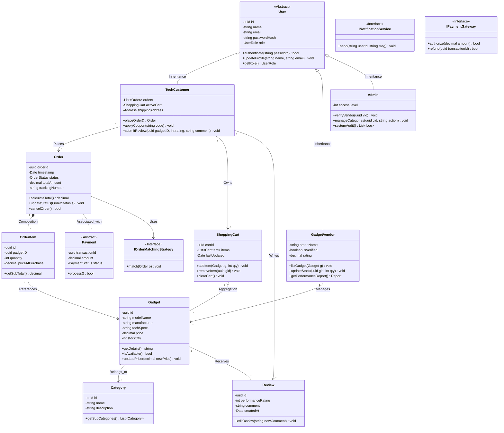

# Class Diagram — TechSpark

## Overview
This class diagram shows the major classes, their attributes, methods, and relationships across the TechSpark platform. The design follows **Clean Architecture** (Controller → Service → Repository) with strong **OOP principles** and **design patterns**.

---

## Design Patterns in the Class Diagram

| Pattern | Where Applied | Purpose |
|---|---|---|
| **Strategy** | `IOrderMatchingStrategy` | Allows switching between different vendor-matching or shipping algorithms at runtime. |
| **Repository** | `Gadget`, `Order` persistence | Decouples the domain logic from the database implementation (Prisma/PostgreSQL). |
| **Strategy** | `Payment` inheritance | Provides different implementations for credit cards, wallets, or crypto. |
| **Observer** | `INotificationService` | Notifies customers automatically when order status changes (e.g., Shipped). |

## OOP Principles Applied
- **Abstraction**: The `User` and `Payment` classes are abstract, hiding implementation details.
- **Inheritance**: `TechCustomer`, `GadgetVendor`, and `Admin` specialize the `User` base class.
- **Encapsulation**: All attributes are private (`-`) and accessed only via public (`+`) methods.
- **Polymorphism**: `INotificationService` can be implemented as Email, SMS, or Push without changing the caller.
- **Composition**: `Order` has a strong lifecycle dependency on `OrderItem`.
