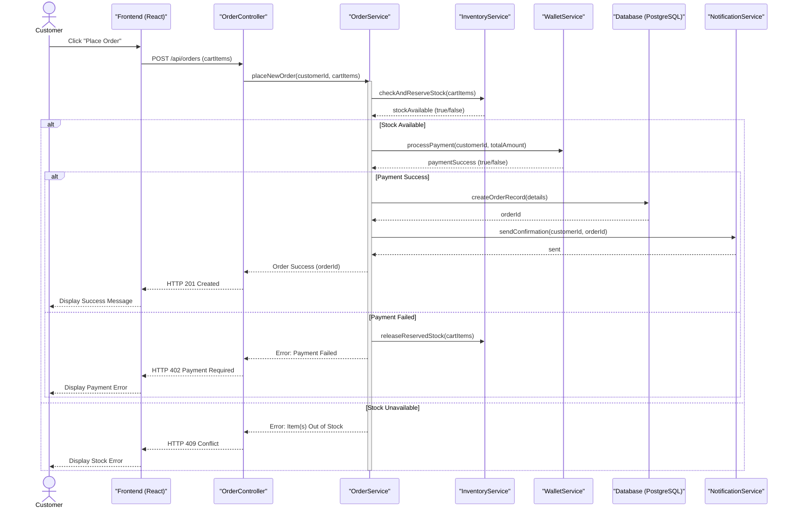

# Sequence Diagram: Checkout & Order Placement

## Overview
This diagram illustrates the end-to-end flow of a customer placing an order, from adding products to the cart to the final order confirmation and notification.

---

