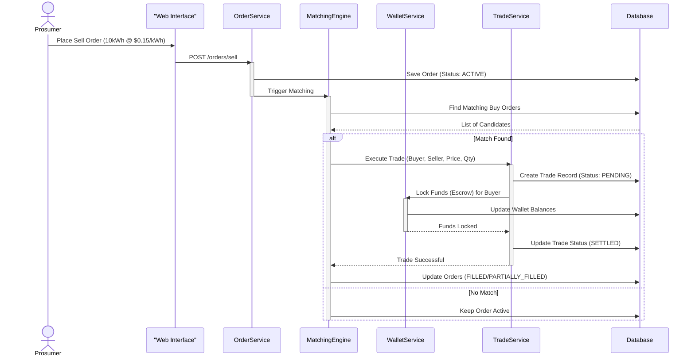

# Sequence Diagram: Order Matching & Trade Settlement

```mermaid
sequenceDiagram
    actor Prosumer
    participant Frontend as "Web Interface"
    participant OrderService
    participant MatchingEngine
    participant WalletService
    participant TradeService
    participant Database

    Prosumer->>Frontend: Place Sell Order (10kWh @ $0.15/kWh)
    Frontend->>OrderService: POST /orders/sell
    activate OrderService
    OrderService->>Database: Save Order (Status: ACTIVE)
    OrderService->>MatchingEngine: Trigger Matching
    deactivate OrderService

    activate MatchingEngine
    MatchingEngine->>Database: Find Matching Buy Orders
    Database-->>MatchingEngine: List of Candidates
    
    alt Match Found
        MatchingEngine->>TradeService: Execute Trade (Buyer, Seller, Price, Qty)
        activate TradeService
        TradeService->>Database: Create Trade Record (Status: PENDING)
        
        TradeService->>WalletService: Lock Funds (Escrow) for Buyer
        activate WalletService
        WalletService->>Database: Update Wallet Balances
        WalletService-->>TradeService: Funds Locked
        deactivate WalletService
        
        TradeService->>Database: Update Trade Status (SETTLED)
        TradeService-->>MatchingEngine: Trade Successful
        deactivate TradeService
        
        MatchingEngine->>Database: Update Orders (FILLED/PARTIALLY_FILLED)
    else No Match
        MatchingEngine->>Database: Keep Order Active
    end
    deactivate MatchingEngine
```
