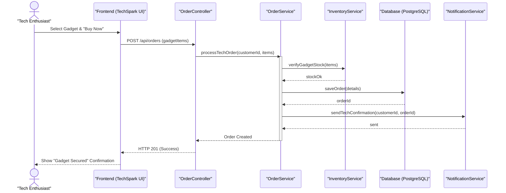

# Sequence Diagram: Tech Gadget Purchase

## Overview
This diagram shows the end-to-end flow of purchasing a gadget on TechSpark, from selection to order confirmation.

---

```mermaid
sequenceDiagram
    actor Customer as "Tech Enthusiast"
    participant FE as "Frontend (TechSpark UI)"
    participant OC as "OrderController"
    participant OS as "OrderService"
    participant IS as "InventoryService"
    participant DB as "Database (PostgreSQL)"
    participant NS as "NotificationService"

    Customer->>FE: Select Gadget & "Buy Now"
    FE->>OC: POST /api/orders (gadgetItems)
    OC->>OS: processTechOrder(customerId, items)
    
    activate OS
    OS->>IS: verifyGadgetStock(items)
    IS-->>OS: stockOk
    
    OS->>DB: saveOrder(details)
    DB-->>OS: orderId
    
    OS->>NS: sendTechConfirmation(customerId, orderId)
    NS-->>OS: sent
    
    OS-->>OC: Order Created
    deactivate OS
    
    OC-->>FE: HTTP 201 (Success)
    FE-->>Customer: Show "Gadget Secured" Confirmation
```
