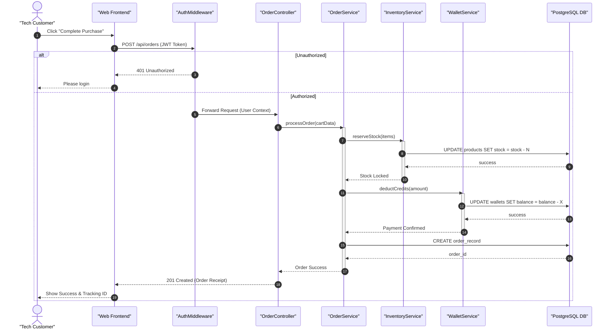

# Sequence Diagram: Gadget Purchase Lifecycle

## Overview
This diagram details the end-to-end execution flow of a "Purchase Order" use case, demonstrating the interaction between decentralized layers (Clean Architecture).

---

## Key Architectural Steps
1. **Authentication**: Requests are intercepted by a middleware to verify identity.
2. **Resource Locking**: The `InventoryService` ensures stock is reserved before payment is processed.
3. **Atomic Persistence**: Data is committed to the database only after business logic validation.
