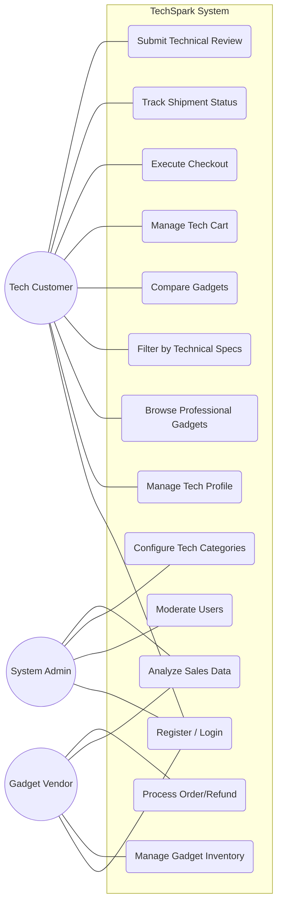

# Use Case Diagram — TechSpark

## Overview
This diagram represents the functional requirements of the TechSpark platform, illustrating how different actors interact with the system to achieve their goals.

---

## Actor Descriptions
- **Tech Customer**: An enthusiast looking for specialized hardware. Can browse, buy, and review tools.
- **Gadget Vendor**: A tech brand or verified seller. Manages inventory, prices, and processes incoming orders.
- **System Admin**: Oversees the platform. Manages categories, verifies vendors, and monitors overall system health.
