```mermaid
graph TB
    subgraph GreenGrid Platform
        UC1["Register / Login"]
        UC2["Manage Profile"]
        UC3["View Energy Dashboard"]
        UC4["Create Sell Order"]
        UC5["Create Buy Order"]
        UC6["View Order Book"]
        UC7["Cancel Order"]
        UC8["View Trade History"]
        UC9["Manage Wallet"]
        UC10["View Settlements"]
        UC11["Set Price Alerts"]
        UC12["View Carbon Credits"]
        UC13["Join Community Group"]
        UC14["View Community Analytics"]
        UC15["Monitor Grid Load"]
        UC16["Manage Compliance Rules"]
        UC17["Trigger Emergency Halt"]
        UC18["View Audit Logs"]
        UC19["Manage Users"]
        UC20["Configure Platform Settings"]
        UC21["Generate Reports"]
        UC22["Manage Grid Zones"]
        UC23["View Energy Forecast"]
        UC24["Auto-Match Orders"]
        UC25["Process Settlement"]
        UC26["Send Notifications"]
        UC27["Manage Smart Meters"]
        UC28["View Leaderboard"]
    end

    Prosumer((Prosumer))
    Consumer((Consumer))
    GridOp((Grid Operator))
    Admin((Admin))

    %% Prosumer use cases
    Prosumer --> UC1
    Prosumer --> UC2
    Prosumer --> UC3
    Prosumer --> UC4
    Prosumer --> UC5
    Prosumer --> UC6
    Prosumer --> UC7
    Prosumer --> UC8
    Prosumer --> UC9
    Prosumer --> UC10
    Prosumer --> UC11
    Prosumer --> UC12
    Prosumer --> UC13
    Prosumer --> UC14
    Prosumer --> UC23
    Prosumer --> UC27
    Prosumer --> UC28

    %% Consumer use cases
    Consumer --> UC1
    Consumer --> UC2
    Consumer --> UC3
    Consumer --> UC5
    Consumer --> UC6
    Consumer --> UC7
    Consumer --> UC8
    Consumer --> UC9
    Consumer --> UC10
    Consumer --> UC11
    Consumer --> UC13
    Consumer --> UC14
    Consumer --> UC28

    %% Grid Operator use cases
    GridOp --> UC1
    GridOp --> UC15
    GridOp --> UC16
    GridOp --> UC17
    GridOp --> UC18
    GridOp --> UC22
    GridOp --> UC21

    %% Admin use cases
    Admin --> UC1
    Admin --> UC19
    Admin --> UC20
    Admin --> UC21
    Admin --> UC18

    %% System-driven (internal)
    UC4 -.->|triggers| UC24
    UC5 -.->|triggers| UC24
    UC24 -.->|on match| UC25
    UC25 -.->|triggers| UC26
    UC11 -.->|triggers| UC26
```

# Use Case Diagram — GreenGrid

## Overview

This diagram shows all major use cases for the GreenGrid platform, organized by the four primary actors: **Prosumer**, **Consumer**, **Grid Operator**, and **Admin**.

---

---

## Use Case Descriptions

| # | Use Case | Actors | Description |
|---|----------|--------|-------------|
| UC1 | Register / Login | All | Create account or authenticate with JWT. Role assigned at registration. |
| UC2 | Manage Profile | Prosumer, Consumer | Update personal info, energy source details, grid zone. |
| UC3 | View Energy Dashboard | Prosumer, Consumer | Real-time view of energy production, consumption, and net balance. |
| UC4 | Create Sell Order | Prosumer | List surplus energy for sale (quantity, price, time window, source type). |
| UC5 | Create Buy Order | Prosumer, Consumer | Place an order to buy energy from the marketplace. |
| UC6 | View Order Book | Prosumer, Consumer | Browse available sell/buy orders in the marketplace. |
| UC7 | Cancel Order | Prosumer, Consumer | Cancel an active (unfilled) order. |
| UC8 | View Trade History | Prosumer, Consumer | See all past completed trades with details. |
| UC9 | Manage Wallet | Prosumer, Consumer | View balance, add funds, withdraw earnings. |
| UC10 | View Settlements | Prosumer, Consumer | See settlement details for completed transactions. |
| UC11 | Set Price Alerts | Prosumer, Consumer | Configure alerts for when energy hits a target price. |
| UC12 | View Carbon Credits | Prosumer | Track green certificates earned from selling renewable energy. |
| UC13 | Join Community Group | Prosumer, Consumer | Join or create a local energy co-operative / microgrid group. |
| UC14 | View Community Analytics | Prosumer, Consumer | See zone-level energy flows, pricing trends, and group stats. |
| UC15 | Monitor Grid Load | Grid Operator | Real-time grid capacity and load visualization by zone. |
| UC16 | Manage Compliance Rules | Grid Operator | Define and update regulatory limits and trading rules. |
| UC17 | Trigger Emergency Halt | Grid Operator | Halt all trading in a specific zone during grid emergencies. |
| UC18 | View Audit Logs | Grid Operator, Admin | Tamper-proof log of all system actions and changes. |
| UC19 | Manage Users | Admin | Create, update, deactivate users. Assign/revoke roles. |
| UC20 | Configure Platform Settings | Admin | System-wide configuration (pricing bounds, fees, zones). |
| UC21 | Generate Reports | Grid Operator, Admin | Generate analytics reports (energy traded, revenue, carbon saved). |
| UC22 | Manage Grid Zones | Grid Operator | Create, update, and configure geographic grid zones. |
| UC23 | View Energy Forecast | Prosumer | Predicted energy production based on weather and historical data. |
| UC24 | Auto-Match Orders | System | Matching engine pairs compatible buy/sell orders automatically. |
| UC25 | Process Settlement | System | Automated settlement after energy delivery confirmation. |
| UC26 | Send Notifications | System | Multi-channel notifications for trades, alerts, and grid events. |
| UC27 | Manage Smart Meters | Prosumer | Register and configure smart meter devices for data ingestion. |
| UC28 | View Leaderboard | Prosumer, Consumer | Community leaderboard for top green energy contributors. |
